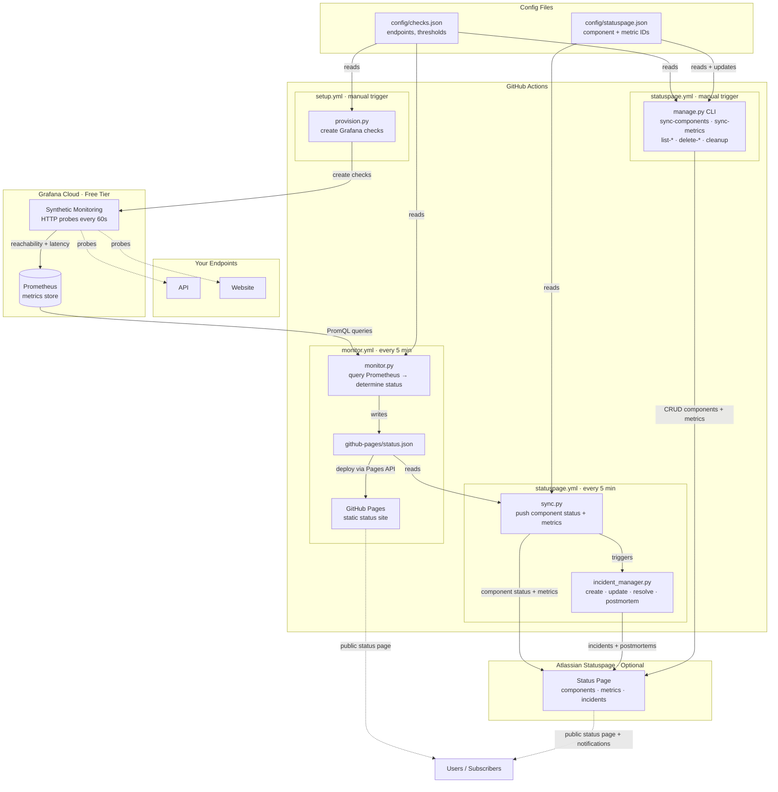

# Status Page

Automated service status page powered by Grafana Cloud (free tier), GitHub Actions, and GitHub Pages — with optional Atlassian Statuspage integration including automated incident management. Zero hosting cost.

**Live status pages:** [GitHub Pages](https://caelicode.github.io/status-page/) · [Atlassian Statuspage](https://caelicode.statuspage.io/)

**[How-To Guide](HOWTO.md)** — step-by-step instructions for adding endpoints, managing components/metrics, incident settings, and troubleshooting.

## How it works



1. **Grafana Cloud** runs synthetic HTTP checks against your endpoints from multiple geographic locations and stores the results as Prometheus metrics.
2. **GitHub Actions** runs `monitor.py` every 5 minutes. It queries Grafana's Prometheus API for reachability and latency, determines each component's status against configurable thresholds, and writes `github-pages/status.json`.
3. **GitHub Pages** serves a static HTML page that reads `status.json` and renders the current status. It auto-refreshes every 60 seconds in the browser.
4. **Atlassian Statuspage** *(optional)* — an independent workflow reads the generated `status.json` and syncs component statuses, latency metrics, and manages the full incident lifecycle (create → update → resolve → postmortem) automatically.

No commit spam — the monitor workflow deploys directly via the Pages API without committing status updates to the repo.

## Prerequisites

1. A [Grafana Cloud](https://grafana.com/auth/sign-up/create-user?pg=pricing&plcmt=free-tier) free account (includes Prometheus, synthetic monitoring, and dashboards).
2. A GitHub repository (public for unlimited Actions minutes, or private with 2,000 free min/month).
3. GitHub Pages enabled on the repository (Settings → Pages → Source: GitHub Actions).

## Setup

### 1. Create a Grafana Cloud account

Sign up at [grafana.com](https://grafana.com/auth/sign-up/create-user?pg=pricing&plcmt=free-tier). The free tier includes 10k Prometheus series, 50 GB logs, and synthetic monitoring.

### 2. Get your Grafana Cloud credentials

From your Grafana Cloud portal:

- **Prometheus URL**: Your Grafana Cloud → Prometheus → Details → Remote Write/Query Endpoint (the `/api/prom/api/v1/query` URL)
- **User ID / Instance ID**: Shown on the Prometheus details page
- **API Key**: Grafana Cloud → API Keys → Create with `MetricsPublisher` role

For provisioning (optional, you can create checks in the UI instead):

- **Synthetic Monitoring Token**: Grafana Cloud → Synthetic Monitoring → Config → Generate API token
- **Stack ID, Metrics Instance ID, Logs Instance ID**: Grafana Cloud → your stack details

### 3. Add GitHub secrets

Go to your repo → Settings → Secrets and variables → Actions, and add:

| Secret | Description |
|--------|-------------|
| `GRAFANA_PROMETHEUS_URL` | Prometheus query endpoint |
| `GRAFANA_PROMETHEUS_USER_ID` | Prometheus instance/user ID |
| `GRAFANA_API_KEY` | Grafana Cloud API key |
| `GRAFANA_SM_TOKEN` | *(setup only)* Synthetic monitoring token |
| `GRAFANA_STACK_ID` | *(setup only)* Stack ID |
| `GRAFANA_METRICS_INSTANCE_ID` | *(setup only)* Metrics instance ID |
| `GRAFANA_LOGS_INSTANCE_ID` | *(setup only)* Logs instance ID |

### 4. Define your checks

Edit `config/checks.json`:

```json
{
  "settings": {
    "reachability_query_window": "15m",
    "latency_query_window": "5m",
    "thresholds": {
      "reachability": { "operational": 95, "degraded": 75 },
      "latency_ms": { "operational": 200, "degraded": 1000 }
    }
  },
  "checks": [
    {
      "name": "My API",
      "job_label": "my-api",
      "url": "https://api.example.com/health",
      "description": "Primary API health endpoint"
    },
    {
      "name": "Website",
      "job_label": "website",
      "url": "https://example.com",
      "description": "Public website",
      "thresholds": {
        "latency_ms": { "operational": 500, "degraded": 2000 }
      }
    }
  ]
}
```

Per-check thresholds are optional. When provided, they override the global thresholds for that check only. Any threshold not specified in the per-check block inherits the global value — in the example above, the Website check uses relaxed latency thresholds (500ms/2000ms) while inheriting the global reachability thresholds (95%/75%).

### 5. Provision checks (optional)

If you want to create synthetic monitoring checks programmatically rather than through the Grafana UI, run the **Provision Grafana Checks** workflow manually from the Actions tab.

### 6. Enable GitHub Pages

Go to Settings → Pages → Build and deployment → Source: **GitHub Actions**.

### 7. Done

The monitor workflow runs every 5 minutes automatically. Your status page will be live at `https://<username>.github.io/<repo-name>/`.

## Project structure

```
├── monitoring/                  Python monitoring package
│   ├── config.py                Config loading (env vars + checks.json)
│   ├── grafana_client.py        Grafana Cloud API client
│   └── status_engine.py         Status determination logic
├── atlassian_statuspage/        Atlassian Statuspage integration
│   ├── client.py                Statuspage REST API client (full CRUD)
│   ├── sync.py                  Reads status.json → syncs to Statuspage
│   ├── incident_manager.py      Automated incident lifecycle + postmortems
│   └── manage.py                CLI for component/metric provisioning
├── setup/
│   └── provision.py             One-time Grafana check provisioning
├── github-pages/                Static site (deployed to GitHub Pages)
│   ├── index.html               Status page UI
│   └── status.json              Auto-generated by monitor
├── config/
│   ├── checks.json              Check definitions and thresholds
│   └── statuspage.json          Statuspage component/metric ID mappings
├── tests/
│   ├── test_status_engine.py    Monitoring unit tests
│   ├── test_statuspage.py       Statuspage client + sync tests
│   ├── test_incident_manager.py Incident automation tests
│   └── test_manage.py           Management CLI tests
├── .github/workflows/
│   ├── monitor.yml              Cron monitor + Pages deployment
│   ├── statuspage.yml           Cron sync + incident automation
│   └── setup.yml                One-time provisioning
├── monitor.py                   Main entry point
├── requirements.txt
└── README.md
```

## Debouncing strategy

Rather than tracking consecutive failures (which needs persistent state between ephemeral GitHub runners), the system uses **wide Prometheus query windows**. The default 15-minute reachability window means a single failed probe among ~15 readings won't flip the status — the average naturally smooths transient blips.

## Status thresholds

| Metric | Operational | Degraded | Major Outage |
|--------|-------------|----------|--------------|
| Reachability | >= 95% | >= 75% | < 75% |
| Latency | <= 200ms | <= 1000ms | > 1000ms |

The worst of reachability and latency determines the component status. The worst component determines overall status. If either metric is unavailable (Prometheus returns no data), the component conservatively defaults to `major_outage`.

## Running tests

```bash
pip install -r requirements.txt
pytest tests/ -v
```

## Atlassian Statuspage integration (optional)

An independent workflow syncs your monitoring data to an [Atlassian Statuspage](https://www.atlassian.com/software/statuspage) (free tier: 25 components, 100 subscribers, 2 metrics).

### 1. Create a Statuspage account

Sign up at [statuspage.io](https://www.atlassian.com/software/statuspage). Create a page and add your components.

### 2. Get your Statuspage credentials

From your Statuspage management dashboard:

- **API Key**: Click your avatar (bottom left) → API info
- **Page ID**: Visible in the URL when managing your page (`manage.statuspage.io/pages/<page_id>`)
- **Component IDs**: Listed in the URL when editing a component, or via `GET https://api.statuspage.io/v1/pages/<page_id>/components`

### 3. Add the GitHub secret

| Secret | Description |
|--------|-------------|
| `STATUSPAGE_API_KEY` | Your Statuspage API key |

### 4. Configure component mappings

Edit `config/statuspage.json` to map your Grafana check job labels to Statuspage component and metric IDs:

```json
{
  "page_id": "your-page-id",
  "component_mapping": {
    "example-api": {
      "name": "Example API",
      "component_id": "your-component-id",
      "metric_id": "your-metric-id-or-empty"
    }
  },
  "incidents": {
    "auto_create": true,
    "auto_postmortem": true,
    "notify_subscribers": true
  }
}
```

The `name` field must match the component name in `config/checks.json`. The `metric_id` is optional — leave it empty (`""`) to skip latency metric submission for that component. The free tier allows 2 metrics.

### 5. Auto-provision components and metrics (optional)

Instead of creating components and metrics manually in the Statuspage UI, you can use the management CLI to auto-create them from your `checks.json`:

```bash
# Create components on Statuspage from checks.json (updates config automatically)
STATUSPAGE_API_KEY=your-key python -m atlassian_statuspage.manage sync-components

# Create latency metrics for each component (updates config automatically)
STATUSPAGE_API_KEY=your-key python -m atlassian_statuspage.manage sync-metrics

# List what's on your page
STATUSPAGE_API_KEY=your-key python -m atlassian_statuspage.manage list-components
STATUSPAGE_API_KEY=your-key python -m atlassian_statuspage.manage list-metrics
STATUSPAGE_API_KEY=your-key python -m atlassian_statuspage.manage list-incidents

# Remove a component and its metric
STATUSPAGE_API_KEY=your-key python -m atlassian_statuspage.manage delete-component example-api

# Remove all managed components and metrics
STATUSPAGE_API_KEY=your-key python -m atlassian_statuspage.manage cleanup -y
```

The `sync-components` command is idempotent: it skips any check that already has a `component_id` in the config, adopts existing Statuspage components by name, and only creates new ones when needed. Similarly, `sync-metrics` skips checks that already have a `metric_id`.

Component and metric provisioning does not have its own workflow — it shares the `statuspage.yml` workflow via a manual trigger dropdown. To run management commands from GitHub Actions without needing local CLI access:

1. Go to **Actions** → **Sync to Atlassian Statuspage** → **Run workflow**
2. Select a command from the dropdown: `sync-components`, `sync-metrics`, `list-components`, `list-metrics`, or `list-incidents`
3. Click **Run workflow**

When a management command is selected, the normal sync flow is skipped entirely. For commands that modify config (`sync-components`, `sync-metrics`), the workflow automatically commits the updated `config/statuspage.json` back to the repo so the new component and metric IDs persist.

Delete commands (`delete-component`, `delete-metric`, `cleanup`) require a job label argument so they must be run from the local CLI.

### 6. Automated incident management

The sync workflow automatically manages incidents based on status changes:

- **Auto-create**: When a component degrades below operational, an incident is created with the appropriate impact level and affected components. Subscribers are notified.
- **Auto-update**: While a component remains degraded/down, the incident is updated with current metrics (without re-notifying subscribers).
- **Auto-resolve**: When a component returns to operational, the incident is resolved and subscribers are notified.
- **Auto-postmortem**: After resolution, a postmortem is auto-generated from the incident timeline (summary, timeline, root cause, preventive measures) and published to the status page.

Component status maps to incident impact as follows:

| Component Status | Incident Impact | Incident Status |
|------------------|----------------|-----------------|
| `degraded_performance` | `minor` | `investigating` |
| `major_outage` | `critical` | `investigating` |
| Recovery → `operational` | — | `resolved` |

Detection is stateless — each run queries Statuspage for unresolved incidents via `GET /incidents/unresolved` and matches them to components. No local state files needed.

To disable incident automation, set `"auto_create": false` in the `incidents` block of `config/statuspage.json`. Postmortems can be independently disabled with `"auto_postmortem": false`.

### 7. Enable the workflow

The `statuspage.yml` workflow runs on the same 5-minute cron as the monitor. It first runs `monitor.py` to generate fresh metrics, then syncs to Statuspage. This makes it fully independent from the GitHub Pages workflow.

## Important notes

- **60-day inactivity timeout**: GitHub disables scheduled workflows after 60 days of no repo activity. Keep the repo active or re-enable manually.
- **Public repos recommended**: GitHub Actions is free and unlimited for public repos. Private repos get 2,000 minutes/month (a 5-min cron burns ~4,300 min/month).
- **Grafana Cloud free tier limits**: 10k active series, 100k synthetic monitoring executions/month.
- **Statuspage API rate limit**: 60 requests per minute. Each sync run uses ~5–6 calls, well within limits.
