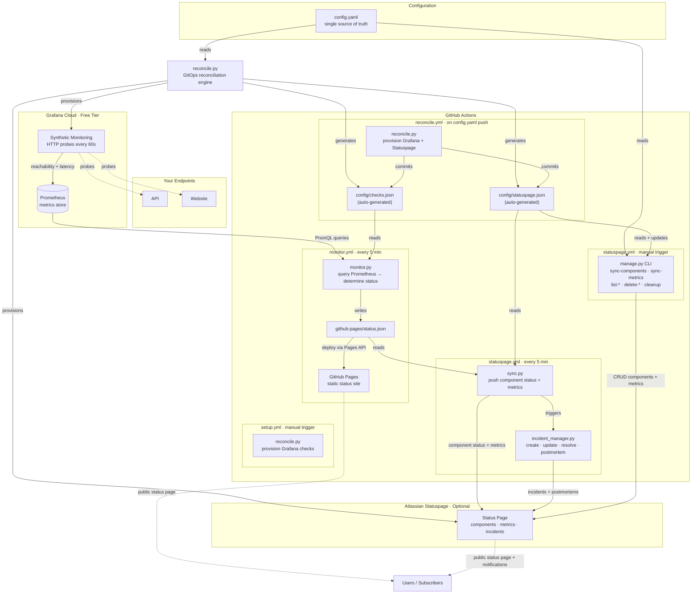

# Status Page

Automated service status page powered by Grafana Cloud (free tier), GitHub Actions, and GitHub Pages — with optional Atlassian Statuspage integration including automated incident management. Zero hosting cost.

**Live status pages:** [GitHub Pages](https://caelicode.github.io/status-page/) · [Atlassian Statuspage](https://caelicode.statuspage.io/)

**[How-To Guide](HOWTO.md)** — step-by-step instructions for adding endpoints, managing components/metrics, incident settings, and troubleshooting.

## How it works



1. **Edit config.yaml** — the single source of truth for all endpoints, thresholds, components, metrics, and settings. No more manual JSON editing.
2. **Push to GitHub** — the `reconcile.yml` workflow auto-triggers, runs `reconcile.py` to provision Grafana checks and Statuspage components/metrics, and commits the generated `config/checks.json` and `config/statuspage.json` back to the repo.
3. **Grafana Cloud** runs synthetic HTTP checks against your endpoints from multiple geographic locations and stores the results as Prometheus metrics.
4. **GitHub Actions** runs `monitor.py` every 5 minutes. It queries Grafana's Prometheus API for reachability and latency, determines each component's status against configurable thresholds, and writes `github-pages/status.json`.
5. **GitHub Pages** serves a static HTML page that reads `status.json` and renders the current status. It auto-refreshes every 60 seconds in the browser.
6. **Atlassian Statuspage** *(optional)* — an independent workflow reads the generated `status.json` and syncs component statuses, latency metrics, and manages the full incident lifecycle (create → update → resolve → postmortem) automatically.

No commit spam — the monitor workflow deploys directly via the Pages API without committing status updates to the repo.

## Prerequisites

1. A [Grafana Cloud](https://grafana.com/auth/sign-up/create-user?pg=pricing&plcmt=free-tier) free account (includes Prometheus, synthetic monitoring, and dashboards).
2. A GitHub repository (public for unlimited Actions minutes, or private with 2,000 free min/month).
3. GitHub Pages enabled on the repository (Settings → Pages → Source: GitHub Actions).

## Setup

### 1. Create a Grafana Cloud account

Sign up at [grafana.com](https://grafana.com/auth/sign-up/create-user?pg=pricing&plcmt=free-tier). The free tier includes 10k Prometheus series, 50 GB logs, and synthetic monitoring.

### 2. Get your Grafana Cloud credentials

**Monitoring credentials** (needed for the 5-minute cron that queries metrics):

1. Go to [grafana.com](https://grafana.com) → **My Account** → your stack
2. Under the **Prometheus** card, click **Details**
3. Note the **Instance ID / User** (this is `GRAFANA_PROMETHEUS_USER_ID`)
4. Copy the **Remote Read URL** — it looks like `https://prometheus-prod-XX-prod-XX-XXXX.grafana.net/api/prom` (this is the base for `GRAFANA_PROMETHEUS_URL`; append `/api/v1/query` to get the full query endpoint)
5. Go to **API Keys** (left sidebar under Security) → **Create API Key** with role `MetricsPublisher` (this is `GRAFANA_API_KEY`)

**Synthetic Monitoring credentials** (needed for the reconcile workflow that auto-provisions checks):

1. Go to your Grafana instance → **Synthetic Monitoring** (left sidebar under Testing & synthetics)
2. Click **Config** (gear icon at the top)
3. Under **API Access Token**, click **Generate token** — this is `GRAFANA_SM_TOKEN`
4. On the same Config page, note the **Backend address** URL — this is `GRAFANA_SM_URL` (defaults to `https://synthetic-monitoring-api-us-east-0.grafana.net` if not set)
5. Go back to [grafana.com](https://grafana.com) → **My Account** → your stack:
   - The **Stack ID** is in the URL: `grafana.com/orgs/<org>/stacks/<stack_id>` — this is `GRAFANA_STACK_ID`
   - Under the **Prometheus** card, the **Instance ID** is `GRAFANA_METRICS_INSTANCE_ID`
   - Under the **Loki** card, the **Instance ID** is `GRAFANA_LOGS_INSTANCE_ID`

### 3. Add GitHub secrets

Go to your repo → **Settings** → **Secrets and variables** → **Actions** → **New repository secret**, and add each of the following:

| Secret | Used by | Description |
|--------|---------|-------------|
| `GRAFANA_PROMETHEUS_URL` | monitor, reconcile | Prometheus query endpoint (e.g. `https://prometheus-prod-XX-....grafana.net/api/prom/api/v1/query`) |
| `GRAFANA_PROMETHEUS_USER_ID` | monitor, reconcile | Prometheus instance/user ID (numeric, found on the Prometheus details page) |
| `GRAFANA_API_KEY` | monitor, reconcile | Grafana Cloud API key with `MetricsPublisher` role |
| `GRAFANA_SM_TOKEN` | reconcile | Synthetic Monitoring API access token (from Synthetic Monitoring → Config → Generate token) |
| `GRAFANA_SM_URL` | reconcile | Synthetic Monitoring backend address (optional — defaults to `https://synthetic-monitoring-api-us-east-0.grafana.net`) |
| `GRAFANA_STACK_ID` | reconcile | Your Grafana Cloud stack ID (numeric, from the stack URL on grafana.com) |
| `GRAFANA_METRICS_INSTANCE_ID` | reconcile | Prometheus instance ID (numeric, from the Prometheus card on grafana.com) |
| `GRAFANA_LOGS_INSTANCE_ID` | reconcile | Loki instance ID (numeric, from the Loki card on grafana.com) |
| `STATUSPAGE_API_KEY` | statuspage, reconcile | Atlassian Statuspage API key (see Statuspage section below) |
| `APP_ID` | reconcile | GitHub App ID for `caelicode-org-manager` (needed to push generated configs to protected branches) |
| `APP_PRIVATE_KEY` | reconcile | GitHub App private key (PEM format, generate from the app's settings page) |

### 4. Define your configuration

Edit `config.yaml` — the single source of truth:

```yaml
statuspage:
  page_id: "your-page-id"

settings:
  thresholds:
    reachability:
      operational: 95
      degraded: 75
    latency_ms:
      operational: 1000
      degraded: 3000

incidents:
  auto_create: true
  auto_resolve: true
  auto_postmortem: true
  notify_subscribers: true
  quiet_period_minutes: 60

endpoints:
  my-api:
    name: "My API"
    url: "https://api.example.com/health"
    description: "Main API endpoint"
    frequency: 60000
    probes: [1, 2, 3]
    component: true
    metric: true

  website:
    name: "Website"
    url: "https://example.com"
    description: "Public website"
    frequency: 60000
    probes: [1, 2, 3]
    component: true
    metric: true
    thresholds:
      latency_ms:
        operational: 2000
        degraded: 5000
```

Per-endpoint thresholds are optional. When provided, they override the global thresholds for that endpoint only. Set `component: true` to sync to Statuspage, and `metric: true` to track latency metrics.

### 5. Push config.yaml to trigger reconciliation

Push your changes to GitHub:

```bash
git add config.yaml
git commit -m "Add endpoints to config"
git push
```

The `reconcile.yml` workflow auto-triggers, runs `reconcile.py` to:
- Provision Grafana synthetic monitoring checks from your config
- Create/update Statuspage components and metrics
- Generate `config/checks.json` and `config/statuspage.json` automatically
- Commit the generated files back to the repo

You can also manually trigger the reconciliation from the Actions tab if needed.

### 6. Enable GitHub Pages

Go to Settings → Pages → Build and deployment → Source: **GitHub Actions**.

### 7. Done

The monitor workflow runs every 5 minutes automatically. Your status page will be live at `https://<username>.github.io/<repo-name>/`.

## Project structure

```
├── monitoring/                  Python monitoring package
│   ├── config.py                Config loading (env vars + config.yaml)
│   ├── grafana_client.py        Grafana Cloud API client
│   └── status_engine.py         Status determination logic
├── atlassian_statuspage/        Atlassian Statuspage integration
│   ├── client.py                Statuspage REST API client (full CRUD)
│   ├── sync.py                  Reads status.json → syncs to Statuspage
│   ├── incident_manager.py      Automated incident lifecycle + postmortems
│   └── manage.py                CLI for component/metric provisioning
├── reconcile.py                    GitOps reconciliation engine (Grafana + Statuspage provisioning)
├── github-pages/                Static site (deployed to GitHub Pages)
│   ├── index.html               Status page UI
│   └── status.json              Auto-generated by monitor
├── config.yaml                     Single source of truth (edit this)
├── config/
│   ├── checks.json              Auto-generated by reconcile.py
│   └── statuspage.json          Auto-generated by reconcile.py
├── tests/
│   ├── test_status_engine.py    Monitoring unit tests
│   ├── test_statuspage.py       Statuspage client + sync tests
│   ├── test_incident_manager.py Incident automation tests
│   ├── test_manage.py           Management CLI tests
│   ├── test_reconcile.py        Reconciliation engine tests
│   └── test_grafana_client.py   Grafana SM registration tests
├── .github/workflows/
│   ├── reconcile.yml            GitOps auto-provisioning (triggers on config.yaml change)
│   ├── monitor.yml              Cron monitor + Pages deployment
│   ├── statuspage.yml           Cron sync + incident automation
│   └── setup.yml                Manual reconciliation trigger (backward compatible)
├── monitor.py                   Main entry point
├── requirements.txt
└── README.md
```

## Debouncing strategy

Rather than tracking consecutive failures (which needs persistent state between ephemeral GitHub runners), the system uses **wide Prometheus query windows**. The default 15-minute reachability window means a single failed probe among ~15 readings won't flip the status — the average naturally smooths transient blips.

## Status thresholds

| Metric | Operational | Degraded | Major Outage |
|--------|-------------|----------|--------------|
| Reachability | >= 95% | >= 75% | < 75% |
| Latency | <= 1000ms | <= 3000ms | > 3000ms |

The worst of reachability and latency determines the component status. The worst component determines overall status. If either metric is unavailable (Prometheus returns no data), the component conservatively defaults to `major_outage`.

## Running tests

```bash
pip install -r requirements.txt
pytest tests/ -v
```

The test suite includes 216 tests covering monitoring, Statuspage sync, incident automation, management CLI, Grafana SM registration, and GitOps reconciliation.

## Atlassian Statuspage integration (optional)

An independent workflow syncs your monitoring data to an [Atlassian Statuspage](https://www.atlassian.com/software/statuspage) (free tier: 25 components, 100 subscribers, 2 metrics).

### 1. Create a Statuspage account

Sign up at [statuspage.io](https://www.atlassian.com/software/statuspage). Create a page.

### 2. Get your Statuspage credentials

From your Statuspage management dashboard:

- **API Key**: Click your avatar (bottom left) → API info
- **Page ID**: Visible in the URL when managing your page (`manage.statuspage.io/pages/<page_id>`)

### 3. Add the GitHub secret

| Secret | Description |
|--------|-------------|
| `STATUSPAGE_API_KEY` | Your Statuspage API key |

### 4. Configure in config.yaml

Add your page ID to `config.yaml`:

```yaml
statuspage:
  page_id: "your-page-id"

endpoints:
  my-api:
    name: "My API"
    component: true
    metric: true
```

Set `component: true` to create/sync the component to Statuspage, and `metric: true` to track latency metrics. The free tier allows 2 metrics.

### 5. Auto-provision components and metrics (optional)

Instead of creating components and metrics manually in the Statuspage UI, you can use the management CLI to auto-create them from your `checks.json`:

```bash
# Create components on Statuspage from checks.json (updates config automatically)
STATUSPAGE_API_KEY=your-key python -m atlassian_statuspage.manage sync-components

# Create latency metrics for each component (updates config automatically)
STATUSPAGE_API_KEY=your-key python -m atlassian_statuspage.manage sync-metrics

# List what's on your page
STATUSPAGE_API_KEY=your-key python -m atlassian_statuspage.manage list-components
STATUSPAGE_API_KEY=your-key python -m atlassian_statuspage.manage list-metrics
STATUSPAGE_API_KEY=your-key python -m atlassian_statuspage.manage list-incidents

# Remove a component and its metric
STATUSPAGE_API_KEY=your-key python -m atlassian_statuspage.manage delete-component example-api

# Remove all managed components and metrics
STATUSPAGE_API_KEY=your-key python -m atlassian_statuspage.manage cleanup -y
```

The `sync-components` command is idempotent: it skips any check that already has a `component_id` in the config, adopts existing Statuspage components by name, and only creates new ones when needed. Similarly, `sync-metrics` skips checks that already have a `metric_id`.

Component and metric provisioning does not have its own workflow — it shares the `statuspage.yml` workflow via a manual trigger dropdown. To run management commands from GitHub Actions without needing local CLI access:

1. Go to **Actions** → **Sync to Atlassian Statuspage** → **Run workflow**
2. Select a command from the dropdown: `sync-components`, `sync-metrics`, `list-components`, `list-metrics`, or `list-incidents`
3. Click **Run workflow**

When a management command is selected, the normal sync flow is skipped entirely. For commands that modify config (`sync-components`, `sync-metrics`), the workflow automatically commits the updated `config/statuspage.json` back to the repo so the new component and metric IDs persist.

Delete commands (`delete-component`, `delete-metric`, `cleanup`) require a job label argument so they must be run from the local CLI.

### 6. Automated incident management

The sync workflow automatically manages incidents based on status changes:

- **Auto-create**: When a component degrades below operational, an incident is created with the appropriate impact level and affected components. Subscribers are notified.
- **Auto-update**: While a component remains degraded/down, duplicate updates are suppressed during a configurable quiet period (default 60 minutes). After the quiet period elapses, a heartbeat update is posted. Escalations (e.g. degraded → outage) always post immediately.
- **Auto-resolve**: When a component returns to operational, the incident is resolved and subscribers are notified.
- **Auto-postmortem**: After resolution, a postmortem is auto-generated from the incident timeline (summary, timeline, root cause, preventive measures) and published to the status page.

Component status maps to incident impact as follows:

| Component Status | Incident Impact | Incident Status |
|------------------|----------------|-----------------|
| `degraded_performance` | `minor` | `investigating` |
| `major_outage` | `critical` | `investigating` |
| Recovery → `operational` | — | `resolved` |

Detection is stateless — each run queries Statuspage for unresolved incidents via `GET /incidents/unresolved` and matches them to components. No local state files needed.

To disable incident automation, set `auto_create: false` in the `incidents` block of `config.yaml`. Postmortems can be independently disabled with `auto_postmortem: false`. The `quiet_period_minutes` setting (default 60) controls how long to suppress duplicate updates before posting a heartbeat — set to `0` to disable suppression.

### 7. Enable the workflow

The `statuspage.yml` workflow runs on the same 5-minute cron as the monitor. It first runs `monitor.py` to generate fresh metrics, then syncs to Statuspage. This makes it fully independent from the GitHub Pages workflow.

## GitOps workflow

The system uses a GitOps approach where `config.yaml` is the single source of truth.

**Workflow:**

1. **Edit config.yaml** — add or modify endpoints, set thresholds, enable Statuspage components/metrics, configure incident automation.
2. **Push to GitHub** — the `reconcile.yml` workflow auto-triggers on changes to `config.yaml`.
3. **Reconciliation engine** — `reconcile.py` reads your configuration and:
   - Creates/updates Grafana synthetic monitoring checks for each endpoint
   - Creates/updates Statuspage components and metrics (if enabled)
   - Generates `config/checks.json` and `config/statuspage.json` from the config
   - Commits generated files back to the repo automatically
4. **Monitoring** — `monitor.py` runs every 5 minutes, reading the generated `checks.json` to determine status.

**Deletion safety:**

When you remove an endpoint from `config.yaml`, the orphaned Grafana check or Statuspage component is preserved by default. To enable automatic deletion of orphaned resources, set the environment variable:

```bash
ALLOW_DELETIONS=true
```

Add this to your GitHub Actions secrets or set it in the `reconcile.yml` workflow.

**Manual trigger:**

You can also trigger reconciliation manually from the GitHub Actions tab:

1. Go to **Actions** → **GitOps Reconciliation** → **Run workflow**
2. Click **Run workflow**

This is useful if you need to re-provision resources or sync without pushing code changes.

## Important notes

- **60-day inactivity timeout**: GitHub disables scheduled workflows after 60 days of no repo activity. Keep the repo active or re-enable manually.
- **Public repos recommended**: GitHub Actions is free and unlimited for public repos. Private repos get 2,000 minutes/month (a 5-min cron burns ~4,300 min/month).
- **Grafana Cloud free tier limits**: 10k active series, 100k synthetic monitoring executions/month.
- **Statuspage API rate limit**: 60 requests per minute. Each sync run uses ~5–6 calls, well within limits.
